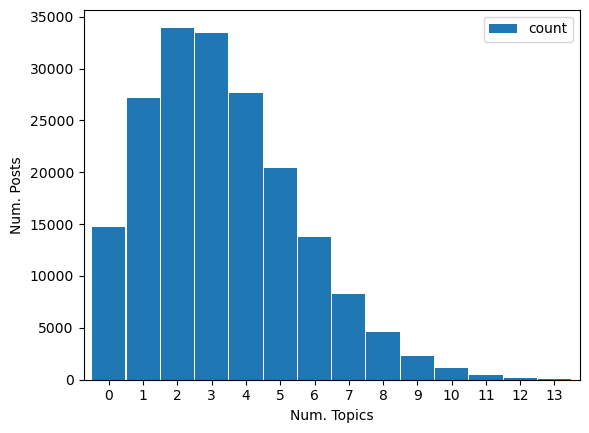

# recommerce-reddit-scraping
   
Bulk of historical data gathered from [The Eye](https://the-eye.eu/redarcs/) (2013-2022) for the following subreddits:
- `r/Depop`
- `r/Flipping`
- `r/poshmark`
- `r/Grailed`
- `r/StockX`
- `r/Etsy`
- `r/Etsysellers`

Scraped / to be scraped (due to younger age of sub)
- `r/DepopUK`
- `r/therealreal`
- `r/grailedtalk`
- `r/ThredUp`

## About the Data
#### Posts
On average, 33.79% of records removed
| site | total records | unique records | pct removed | start date | end date |
|--|--|--|--|--|--|
| depop | 126,523 | 39,167 | 0.690436 | 2015-08-20 | 2022-12-31 |
| etsysellers | 38,292 | 24,978 | 0.347697 | 2013-04-03 | 2022-12-31 |
| etsy | 98,967 | 43,270 | 0.562784 | 2009-03-16 | 2022-12-31 |
| flipping | 92,907 | 42,310 | 0.544598 | 2013-08-21 | 2022-12-31 |
| grailed | 20,449 | 4,881 | 0.761309 | 2015-03-05 | 2022-12-31 |
| poshmark | 57,893 | 22,881 | 0.604771 | 2014-11-11 | 2022-12-31 |
| stockx | 23,288 | 10,321 | 0.556810 | 2017-12-10 | 2022-12-31 |

#### Comments
On average, 12.24% of records removed
| site | total records | unique records | unique linked posts | pct removed |
|--|--|--|--|--|
depop | 810,794 | 718,825 | 378,672 | 0.113431 |
etsysellers | 339,569 | 310,249 | 162,599 | 0.086345 |
etsy | 662,752 | 603,159 | 303,311 | 0.089917 |
flipping | 1,591,386 | 1,475,464 | 773,985 | 0.072843 |
grailed | 55,955 | 43,363 | 28,159 | 0.225038 |
poshmark | 566,272 | 467,946 | 227,477 | 0.173637 |
stockx | 140,024 | 126,593 | 75,929 | 0.095919 |

### Feature Engineering
After initial cleaning steps (managed datatypes, removing duplicates, removed deleted posts and null posts, removed unused columns):   
- Generated label of another website/platform was mentioned in post body or poll options. Platforms accounted for: Depop, EtsySellers, Etsy, Flipping, Grailed, poshmark, stockx, Mercari, ThredUp, TheRealReal, TRR, Ebay, FB Marketplace
- Used `author_flair_text` to label if someone is a self-identified buyer/seller, rudimentary labeling if they tag their store
- Extracted poll options, votes, and total votes from poll posts
- Labeled posts for various key topics (see below for details on topic labeling process)
- Utilized `KMeans` (7 clusters) with `CountVectorizer` output (1,3grams, 0.2-1.0 document frequency, 5,000 max features) to create simple clusters to investigate topics further

#### Topic Labeling
Topics were generated using post's text body. Text was preprocessed with `RegexpTokenizer` to remove all non-alpha characters, `WordNetLemmatizer` with default parameters, and customized English stopwords list.
   
Processed posts were passed into three `CountVectorizer` models:
- Model 1: 1grams with 0.2-1.0 document frequency, 500 max features
- Model 2: 1-2grams with 0.2-1.0 document frequency, 2,000 max features
- Model 3: 3grams with 0.2-1.0 document frequency, max 500 features

Reviewed those to gather key terms/phrases grouped into common themes, organized in a dictionary used to generate labels.
   
**Overal topic frequency:**
| topic | frequency |
|--|--|
| selling | 0.41 |
| order | 0.40 |
| item | 0.30 |
| shipping | 0.37 |
| account | 0.36 |
| money/payment | 0.33 |
| listing | 0.24 |
| customer | 0.23 |
| advice | 0.22 |
| problem | 0.11 |
| return | 0.10 |
| images | 0.09 |
| flipping | 0.06 |
   
**Topic Counts distribution**

   
#### Polls
Utilized text extraction to isolate total votes, options and their vote counts.   
10,730 polls with 218,798 total votes cast - an average of 184 votes per poll.

To-do:
- investigate topics within polls

## About the Users

To Do:
- Start on feature engineering
- Add simple visualizations to README

